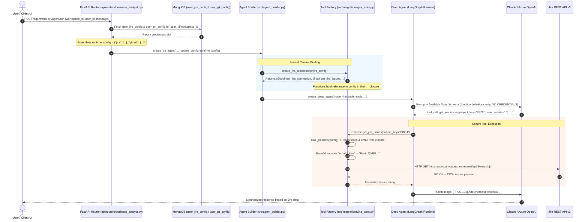

# MCP Integration Architecture: Jira & GitHub for Business Analyst Deep Agent

## 1. Executive Summary

This document defines the architectural strategy for decoupling **Jira** and **GitHub** integrations in the **Business Analyst Deep Agent** (`dynamicworkflow`). 

Currently, Jira and GitHub integrations are implemented as tightly coupled, bespoke LangChain tools inside `dynamicworkflow/src/integrations/jira_tools.py` (3 tools) and `github_tools.py` (6 tools). By transitioning to the **Model Context Protocol (MCP)**, the BA Agent can dynamically connect to standardized MCP servers (both official and self-hosted) provided by Atlassian and GitHub. This grants the agent access to comprehensive tool catalogs (issue lifecycle, epic tracking, agile sprints, commit history, pull request reviews, repo trees) without manual API maintenance.

---

## 2. Part 1: Current Credential Lifecycle (MongoDB to Tool Call)

### 2.1 Storage Schema
When a user submits credentials in the UI, they are persisted into MongoDB collections (e.g. `user_jira_config` and `user_git_config` / `ba_user_config`):

```json
// user_jira_config
{
  "user_id": "usr_102938",
  "workspace_id": "ws_alpha",
  "jira_url": "https://company.atlassian.net",
  "jira_email": "ba_lead@company.com",
  "jira_access_token": "ATATT3xFfGF...",
  "jira_project_key": "PROJ",
  "active": true,
  "updated_at": "2026-09-14T20:00:00Z"
}

// user_git_config
{
  "user_id": "usr_102938",
  "workspace_id": "ws_alpha",
  "github_token": "ghp_xxxxxxxxxxxx",
  "github_repo_full_name": "org/npd-product-specs",
  "github_branch": "main",
  "active": true,
  "updated_at": "2026-09-14T20:00:00Z"
}
```

### 2.2 End-to-End Execution Flow



### 2.3 Why the LLM Never Sees the Credentials
1. **Tool Schema Abstraction:** When LangChain registers tools to the LLM (via OpenAI tool call or Anthropic tool use parameters), it only sends the function name, docstring, and input arguments (e.g. `project_key: str`, `max_results: int`).
2. **Python Lexical Scoping (Closures):** Inside `create_jira_tools(config)`, helper functions `_headers(config)` and `_base_url(config)` enclose the `config` dictionary in memory. 
3. **Zero Token Leaks:** The credentials live purely within the worker process memory during the duration of the HTTP request and are injected into outgoing `Authorization` headers.

---

## 3. Part 2: Deep Exploration of Atlassian & GitHub MCP Ecosystem

### 3.1 GitHub MCP Server

GitHub provides an **Official GitHub MCP Server** maintained under the Model Context Protocol organization and GitHub's official open source initiatives (`github/github-mcp-server`).

#### Deployment Modes:
1. **Remote Managed Endpoint:** `https://api.githubcopilot.com/mcp/` (Enterprise / Copilot-hosted via OAuth 2.0).
2. **Docker / Binary Stdio Server:** `docker run -i --rm -e GITHUB_PERSONAL_ACCESS_TOKEN ghcr.io/modelcontextprotocol/servers/github:latest` or `npx -y @modelcontextprotocol/server-github`.

#### Catalog of Available GitHub MCP Tools:
| Tool Category | Available Tools Out-of-the-box |
| :--- | :--- |
| **Repositories** | `search_repositories`, `get_file_contents`, `create_or_update_file`, `push_files`, `list_commits` |
| **Branches & Git**| `list_branches`, `create_branch`, `get_branch`, `get_tree` (recursive directory inspection) |
| **Pull Requests** | `create_pull_request`, `list_pull_requests`, `get_pull_request`, `create_pull_request_review_comment` |
| **Issues** | `list_issues`, `create_issue`, `get_issue`, `add_issue_comment`, `update_issue` |
| **Search** | `search_code`, `search_issues` |

*Comparison:* Instead of our 6 handwritten GitHub functions in `github_tools.py`, the agent immediately gains full read/write Git repository control, branching, PR review threads, and code search capabilities.

---

### 3.2 Atlassian & Jira MCP Server

There are two primary approaches for Jira:

1. **Official Atlassian Rovo MCP Server:**
   - **Endpoint:** `https://mcp.atlassian.com/v2/mcp`
   - **Protocol:** Cloud-hosted remote MCP over Server-Sent Events (SSE) / HTTP.
   - **Authentication:** OAuth 2.1 (and API tokens where allowed by enterprise admin).
   - **Scope:** Cross-product (Jira Cloud, Confluence, Bitbucket, Compass, JSM).
   - **Best for:** Enterprise cloud deployments with central SSO / Rovo subscription.

2. **Self-Hosted / Containerized Jira MCP Server (`@modelcontextprotocol/server-jira` or `mcp-atlassian`):**
   - **Command:** `npx -y @modelcontextprotocol/server-jira` or `python -m mcp_server_jira`
   - **Protocol:** Local `stdio` transport or Docker container.
   - **Authentication:** Accepts `JIRA_API_TOKEN`, `JIRA_EMAIL`, `JIRA_DOMAIN` (matching the exact user credentials stored in your MongoDB!).
   - **Available Tools:**
     - `jira_search_issues` (full JQL with expand, fields, pagination)
     - `jira_get_issue` (detailed issue metadata, custom fields, comments)
     - `jira_create_issue` (creates user stories, bugs, epics)
     - `jira_update_issue` / `jira_transition_issue` (workflow status changes)
     - `jira_get_all_projects` / `jira_get_project_versions`
     - `jira_add_comment`

---

## 4. Part 3: Architecture for Fitting MCP into BA_Agent (Deep Agent Framework)

### 4.1 Integration Pattern via `langchain-mcp-adapters`

The `langchain-mcp-adapters` library bridges MCP servers with LangGraph / Deep Agent agents. It provides `MultiServerMCPClient`, which can manage multiple MCP servers simultaneously.

```
       ┌────────────────────────────────────────────────────────┐
       │                Deep Agent (LangGraph)                  │
       │                                                        │
       │   System Prompt (BA_BUSINESS_ANALYST_SKILL.md)         │
       │   Storage Backend (Filesystem / AzureBlob / S3)       │
       │   Durable Checkpointer (MongoDBSaver)                  │
       └───────────────────────────┬────────────────────────────┘
                                   │
                    Loads tools via LangChain interface
                                   │
       ┌───────────────────────────▼────────────────────────────┐
       │              MultiServerMCPClient                      │
       │           (langchain-mcp-adapters)                     │
       └──────────────┬───────────────────────────┬─────────────┘
                      │ stdio / SSE               │ stdio / SSE
       ┌──────────────▼─────────────┐ ┌───────────▼─────────────┐
       │     Jira MCP Server        │ │     GitHub MCP Server   │
       │ (npx @mcp/server-jira)     │ │ (npx @mcp/server-github)│
       │ - Dynamic User Env         │ │ - Dynamic User PAT      │
       └──────────────┬─────────────┘ └───────────┬─────────────┘
                      │ REST API v3               │ REST / GraphQL
       ┌──────────────▼─────────────┐ ┌───────────▼─────────────┐
       │      Atlassian Cloud       │ │       GitHub API        │
       └────────────────────────────┘ └─────────────────────────┘
```

### 4.2 Multi-Tenant Challenge & Solution: Dynamic Per-Session Initialization

In a multi-tenant web application, User A and User B have different Jira domains and GitHub PATs. We cannot run a single static MCP process with global environment variables.

#### Solution: Request-Scoped MCP Client Creation
When `create_ba_agent` is called, `MultiServerMCPClient` is initialized with the credentials from `runtime_config`:

```python
from langchain_mcp_adapters.client import MultiServerMCPClient

async def build_mcp_tools_for_session(runtime_config: dict) -> tuple[list, MultiServerMCPClient]:
    """Dynamically spawn user-scoped MCP clients and convert tools to LangChain BaseTools."""
    jira_cfg = runtime_config.get("jira") or {}
    git_cfg = runtime_config.get("github") or {}
    
    server_configs = {}

    # Configure Jira MCP Server (User-scoped stdio subprocess via @nexus2520/jira-mcp-server)
    if jira_cfg.get("active"):
        jira_url = jira_cfg.get("jira_url", "")
        if jira_url and not jira_url.startswith("http"):
            jira_url = f"https://{jira_url}"
        server_configs["jira"] = {
            "command": "npx",
            "args": ["-y", "@nexus2520/jira-mcp-server"],
            "transport": "stdio",
            "env": {
                "JIRA_BASE_URL": jira_url,
                "JIRA_EMAIL": jira_cfg.get("jira_email", ""),
                "JIRA_API_TOKEN": jira_cfg.get("jira_access_token", ""),
            }
        }

    # Configure GitHub MCP Server (User-scoped stdio subprocess)
    if git_cfg.get("active"):
        server_configs["github"] = {
            "command": "npx",
            "args": ["-y", "@modelcontextprotocol/server-github"],
            "transport": "stdio",
            "env": {
                "GITHUB_PERSONAL_ACCESS_TOKEN": git_cfg.get("github_token", ""),
            }
        }

    client = MultiServerMCPClient(server_configs)
    # Automatically discovers and returns LangChain BaseTool instances
    mcp_tools = await client.get_tools()
    return mcp_tools, client
```

### 4.3 Handling Deep Agent Specific Tools (BRD Sync)

Notice a key difference between standard GitHub operations and our custom `push_brd_to_github`:
`push_brd_to_github` specifically synchronizes `workspace/<agent_folder>/BRD.md` with the cloud storage backend (Azure Blob / S3 / Filesystem).

With MCP, we have two elegant design choices:
1. **Hybrid Approach (Recommended for Phase 1):**
   - Use MCP for all general discovery and authoring tools: `jira_search_issues`, `jira_create_issue`, `github_create_pull_request`, `github_search_code`, `github_list_commits`.
   - Keep domain-specific BA bridge tools (like `push_brd_to_github` and `pull_brd_from_github`) in `agent_tools.py` because they bind directly to the internal agent workspace storage backend.
2. **Pure MCP Approach (Phase 2):**
   - Teach the agent via `BA_BUSINESS_ANALYST_SKILL.md`:
     1. Read `BRD.md` from its local workspace using its built-in filesystem backend.
     2. Call the GitHub MCP tool `create_or_update_file(path="docs/BRD.md", content=..., branch=...)`.
     3. Call the GitHub MCP tool `create_pull_request(head=..., base="main")`.

### 4.4 Tool Filtering (Preventing Context Window Bloat)

An MCP server may expose 25+ tools each. Loading both Jira and GitHub MCP servers could add 50+ tool schemas to every LLM turn, consuming tokens and risking model confusion.

**Filter Pattern:**
```python
ALLOWED_JIRA_TOOLS = {
    "jira_search_issues",
    "jira_get_issue",
    "jira_create_issue",
    "jira_add_comment",
    "jira_get_all_projects",
}

ALLOWED_GITHUB_TOOLS = {
    "create_or_update_file",
    "get_file_contents",
    "create_branch",
    "list_branches",
    "create_pull_request",
    "list_commits",
}

def filter_mcp_tools(all_tools: list) -> list:
    allowed = ALLOWED_JIRA_TOOLS | ALLOWED_GITHUB_TOOLS
    return [t for t in all_tools if t.name in allowed]
```

---

## 5. Architectural Comparison Matrix

| Dimension | Current Custom Tools (`jira_tools.py` / `github_tools.py`) | MCP Server Architecture (`MultiServerMCPClient`) |
| :--- | :--- | :--- |
| **Coupling** | **Tight:** Custom `httpx` logic, manually written HTTP headers, static payloads. | **Loose:** Decoupled standard protocol; server handles API schemas and evolution. |
| **Maintenance** | High: Any Jira API / GitHub change requires modifying Python code. | Zero for API updates: Handled by MCP server maintainers. |
| **Feature Richness** | Only 3 Jira + 6 GitHub functions. | 30+ tools per integration (epics, components, workflow transitions, full git operations). |
| **Security / Creds** | Handled via Python function closures. | Handled via session-scoped sub-process `env` or OAuth tokens. |
| **Testing** | Requires mocking HTTP requests in unit tests. | Standardized MCP client protocol tests. |

---

## 6. Implementation Roadmap

1. **Step 1: Install Dependencies**
   ```bash
   pip install langchain-mcp-adapters mcp
   ```
2. **Step 2: Create MCP Integration Layer**
   - Add `src/integrations/mcp_hub.py` encapsulating `build_mcp_tools_for_session` and tool filtering.
3. **Step 3: Update `agent_builder.py`**
   - In `create_ba_agent(...)`, replace direct calls to `create_jira_tools` and `create_github_tools` with async tool acquisition from `mcp_hub.py`.
4. **Step 4: Update `BA_BUSINESS_ANALYST_SKILL.md`**
   - Update prompt instructions to describe the standardized MCP tool names (`jira_search_issues`, `github_create_pull_request`) and guidelines on when to invoke them.
